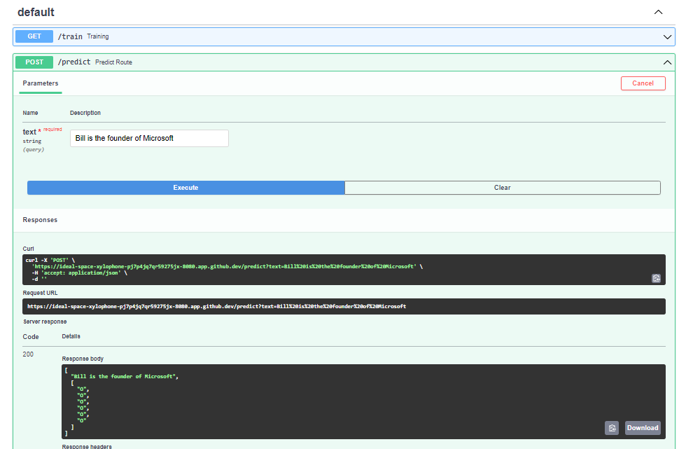
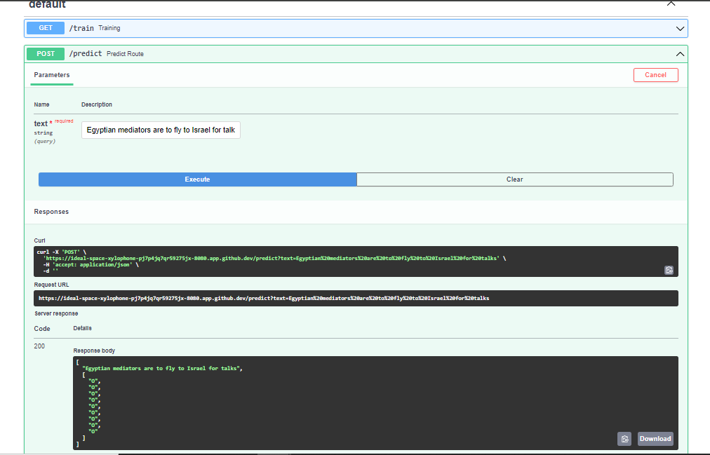

# Named Entity Recognition

# Introduction

The **NER (Named Entity Recognition)** project focuses on extracting and classifying named entities such as persons, organizations, and locations from text using a **fine-tuned BERT model**. The system leverages state-of-the-art NLP techniques to build a highly accurate NER model. The primary goal is to provide a robust and scalable solution for named entity extraction that can be integrated into real-world applications.

This project also follows an MLOps pipeline to ensure smooth deployment and maintainability. The MLOPS end-to-end pipeline workflow includes steps for **data preprocessing**, tokenization using BERT’s tokenizer, **model training**, and **model evaluation**. The data is processed into a format suitable for BERT, and the model is trained using a custom architecture based on pre-trained BERT models. **FastAPI** is used to provide an easy-to-use API interface, enabling efficient interaction with the model for real-time text processing.

To ensure streamlined development and deployment, the project incorporates a **CI/CD pipeline** using **CircleCI**, **Docker**, and **Amazon ECR**. The code is continuously integrated and deployed, with Docker ensuring consistent environments across different stages. **CircleCI** automates testing and deployment, while **Amazon ECR** handles container management. This setup guarantees that the application remains up-to-date and scalable with minimal manual intervention.


## Tech Stack Used
1) Python
2) PyTorch
3) Hugging Face Transformers (BERT)
4) Docker
5) FastAPI

## Infrastructure
1) DockerHub
2) AWS Elastic Container Registry (ECR)
3) GitHub
4) CircleCI (CI/CD)

## System Design


## Dataset

The dataset used in this project consists of labeled text for **Named Entity Recognition (NER)**, where each word in the text is tagged with its corresponding entity label. The dataset follows the typical NER format with tokens and corresponding labels for various entity types such as **Person (PER)**, **Organization (ORG)**, and **Location (LOC)**.

You can either download an existing dataset or use your custom data by formatting it to match the token-label format required for NER tasks. Here is the Dataset [Link](data/ner.csv)

## Dataset Information

* **Source**: The dataset can either be a publicly available NER dataset like **CoNLL-2003** or a custom dataset tailored for specific entity recognition tasks.
* **Format**: Each sentence in the dataset is split into individual tokens, and each token is assigned a label such as **B-PER**, **I-LOC**, etc., using the **BIO (Beginning, Inside, Outside)** tagging scheme.
* **Preprocessing**: The text is tokenized using BERT’s tokenizer to align the tokens with the labels for efficient model input.

#### Dataset Details<a id='dataset-details'></a>
<pre>
Dataset Name            : CoNLL-2003
Number of Class         : 2
Number/Size of Images   : Total      : 47960 (4.8 MB)
                          Training   : 47960
                          Testing    : 2000
                          Validation : 2000 

</pre>
## Results<a id='results-'></a>
We have achieved following results with BERT based pretrained model named ***bert-base-cased***.

<pre>
<b>Performance Metrics </b>
Training Accuracy                                 : 86.7%
Testing Accuracy                                  : 85.48%
</pre>

## Installation
    
The Code is written in Python 3.8.19. If you don't have Python installed you can find it here. If you are using a lower version of Python you can upgrade using the pip package, ensuring you have the latest version of pip.

## Run Locally

### Step 1: Clone the repository
```bash
git clone https://github.com/jcole313/NER
```
### Step 2- Create a conda environment after opening the repository
```bash
conda create -p env python=3.8 -y
```
```bash
source activate ./env
```
### Step 3 - Install the requirements
```bash
pip install -r requirements.txt
```

### Step 4 - Create AWS IAM user with following Permissions Enabled

* **AdministratorAccess**
* **AmazonEC2ContainerRegistryFullAccess**
* **AmazonEC2FullAccess**


### Step 5 - Configure your AWS
```bash
aws configure
```

### Step 6 - Enter your AWS Credentials of IAM User
```bash
AWS_SECRET_ACCESS_KEY = ""
AWS_ACCESS_KEY_ID = ""
AWS_REGION = "us-east-1"
AWS_FOLDER = Press Enter and move on
```

### Step 7 - Prepare your Dataset zip file named archive.zip
Your Zip file should contain following folders and files in this order:
```bash
archive.zip
│
├── ner.csv
```

* **Here is my Datset Zip: [LINK](data/archive.zip)**

### Step 8 - Upload the Dataset zip file to your S3 Bucket
```bash
aws s3 cp path/to/your/archive.zip s3://your-bucket-name/archive.zip
```

### Step 9 - Run the application server
```bash
python app.py
```

### Step 10 - Prediction application
```bash
http://localhost:8080/docs

```

### Step 11 - If model is not trained and not present in your S3 bucket
```bash
Run the training Pipeline by clicking on train button in FastAPI UI
```

## Prediction Outputs



## AWS Deployment Steps
### Step 1 - Login to AWS console.

### Step 2 - Create IAM user for deployment with following Permissions Enabled

* **AdministratorAccess**
* **AmazonEC2ContainerRegistryFullAccess**
* **AmazonEC2FullAccess**

### Important Points:
1. **EC2 access** : It is virtual machine

2. **ECR**: Elastic Container registry to save your docker image in aws


### Description: About the deployment in the Backend

1. Build docker image of the source code

2. Push your docker image to ECR

3. Launch Your EC2 

4. Pull Your image from ECR in EC2

5. Lauch your docker image in EC2

### Step 3 - Create ECR repo to store/save docker image
```bash
Save your ECR URI: 136566696263.dkr.ecr.us-east-1.amazonaws.com/nerdemo
```

### Step 4 - Create EC2 machine (Ubuntu)
```bash
Use t2.large or greater size instances only as it is a Computer Vision project
```

### Step 5 - Connect EC2 Instance and Install docker in EC2 Machine:

### Run all the commands given in the **scripts/VM-machine-setup.sh** file, in the EC2 Instance Command Line.

### Step 6 - Configure EC2 as self-hosted runner in CircleCI:
```bash
CircleCI-->Self-hosted Runner--> Choose Yes, agree all the terms
```

### Step 7 - Setup CicleCI secrets of your Project:
```bash
AWS_ACCESS_KEY_ID=

AWS_SECRET_ACCESS_KEY=

AWS_REGION = us-east-1

AWS_ECR_REGISTRY_ID = "Your AWS account:ID"
```

### Step 8 - Add Inbound Rules in EC2 Instance
```bash
Select your EC2 Instance--> Security groups--> Add Inbound Rules--> Custom TCP(8080 and 0.0.0.0)--> save
```

### Step 9 - Run the Public Port of EC2 Instance
```bash
Public_Address:8080
```

## Conclusion
1. **State-of-the-Art NER Model**: The project leverages a **fine-tuned BERT model (bert-base-cased)**, achieving high accuracy in extracting and classifying named entities like persons, organizations, and locations.

2. **End-to-End MLOps Pipeline**: The entire machine learning workflow, consisting of data preprocessing, data transformation, model training and model evaluation, is automated, ensuring seamless model development and deployment.

3. **FastAPI Integration**: The model is served through a **FastAPI** interface, providing an easy-to-use and efficient API for real-time predictions.

4. **CI/CD with CircleCI**: Continuous integration and deployment are managed via **CircleCI**, automating testing, containerization with Docker, and deployment to AWS.

5. **Scalable and Robust Infrastructure**: The use of Docker and AWS services like **ECR** ensures scalability and consistency across environments, making the solution ready for production-level deployment.