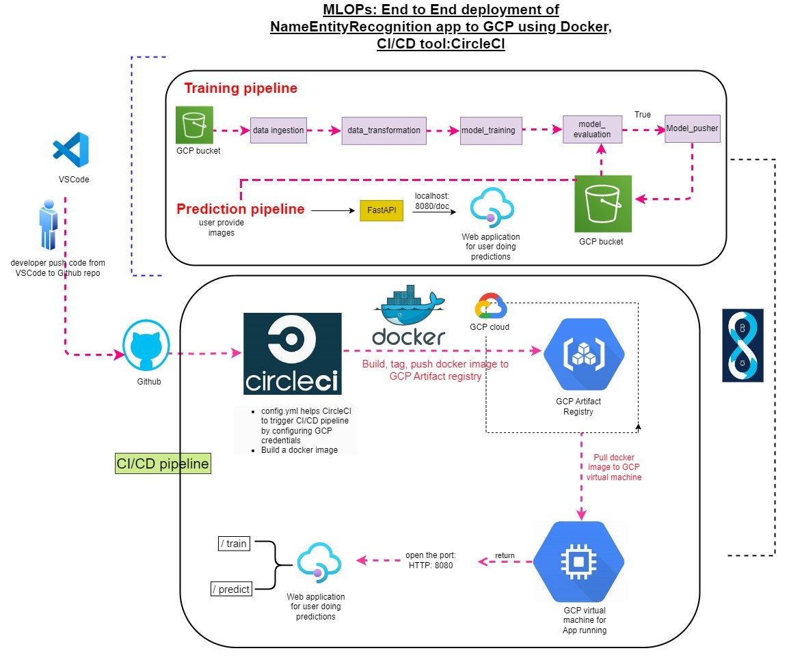

# Named Entity Recognition

# Introduction

The NER (Named Entity Recognition) project focuses on extracting and classifying named entities such as persons, organizations, and locations from text using a fine-tuned BERT model. The system leverages state-of-the-art NLP techniques to build a highly accurate NER model. The primary goal is to provide a robust and scalable solution for named entity extraction that can be integrated into real-world applications.

This project also follows an MLOps pipeline to ensure smooth deployment and maintainability. The workflow includes steps for data preprocessing, tokenization using BERT’s tokenizer, model training, and evaluation. The data is processed into a format suitable for BERT, and the model is trained using a custom architecture based on pre-trained BERT models. FastAPI is used to provide an easy-to-use API interface, enabling efficient interaction with the model for real-time text processing.

To ensure streamlined development and deployment, the project incorporates a CI/CD pipeline using CircleCI, Docker, and Amazon ECR. The code is continuously integrated and deployed, with Docker ensuring consistent environments across different stages. CircleCI automates testing and deployment, while Amazon ECR handles container management. This setup guarantees that the application remains up-to-date and scalable with minimal manual intervention.

## Tech Stack Used
1) Python
2) PyTorch
3) Hugging Face Transformers (BERT)
4) Docker
5) FastAPI

## Infrastructure
1) DockerHub
2) AWS Elastic Container Registry (ECR)
3) GitHub
4) CircleCI (CI/CD)

## System Design

## Dataset

The dataset used in this project consists of labeled text for Named Entity Recognition (NER), where each word in the text is tagged with its corresponding entity label. The dataset follows the typical NER format with tokens and corresponding labels for various entity types such as Person (PER), Organization (ORG), and Location (LOC).

* Source: The dataset can either be a publicly available NER dataset like CoNLL-2003 or a custom dataset tailored for specific entity recognition tasks.
* Format: Each sentence in the dataset is split into individual tokens, and each token is assigned a label such as B-PER, I-LOC, etc., using the BIO (Beginning, Inside, Outside) tagging scheme.
* Preprocessing: The text is tokenized using BERT’s tokenizer to align the tokens with the labels for efficient model input.

You can either download an existing dataset or use your custom data by formatting it to match the token-label format required for NER tasks. Here is the Dataset [Link](data/ner.csv)

